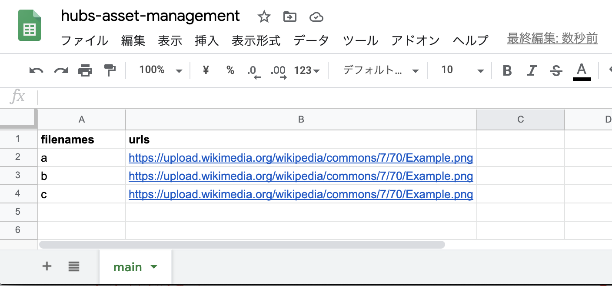
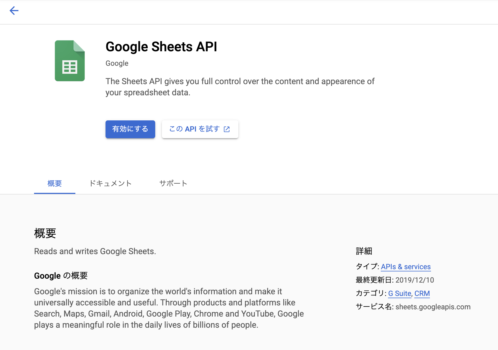

<h1 align="center">hubs-asset-api</h1>
<p>
  
  <a href="#" target="_blank">
    
  </a>
</p>

This Firebase project offers an API that returns 302 redirect to URLs written on a Google Sheets. This is useful for editing assets' URLs of [Mozilla Hubs](https://hubs.mozilla.com/) / [Hubs Cloud](https://hubs.mozilla.com/cloud) from outside of Hubs or Spoke.

## Usage
### 1. Prepare Firebase Project

- Create Firebase Project at https://console.firebase.google.com/
- Switch tothe **Blaze Plan** (it is necessary if we want to use Node.js 10 in Cloud Functions)
- Get firebase CLI

```bash
$ npm i -g firebase-tools
$ firebase login
$ firebase projects:list
$ firebase use {your-project-id}
```

### 2. Prepare Google Sheets
- Create [a new spreadsheet](https://docs.google.com/spreadsheets/) which describes pairs of API paths and destination URLs



- Enable a link sharing for **anyone with the link**
- Copy the Spreadsheet ID from the URL (`https://docs.google.com/spreadsheets/d/{spreadsheetId}/edit#gid=0`)
- Set information of the spreadsheet in the project

```bash
$ cp functions/config/example.yaml functions/config/default.yaml
$ vi functions/config/default.yaml
```

### 3. Enable Sheets API
- Open Google Sheets API on the GCP Console: https://console.cloud.google.com/apis/library/sheets.googleapis.com
- Enable Google Sheets API in your Firebase project




### 4. Deploy Project

- `firebase deploy`
- Try to access the function's URL (e.g. https://us-central1-{your-project-id}.cloudfunctions.net/a)
